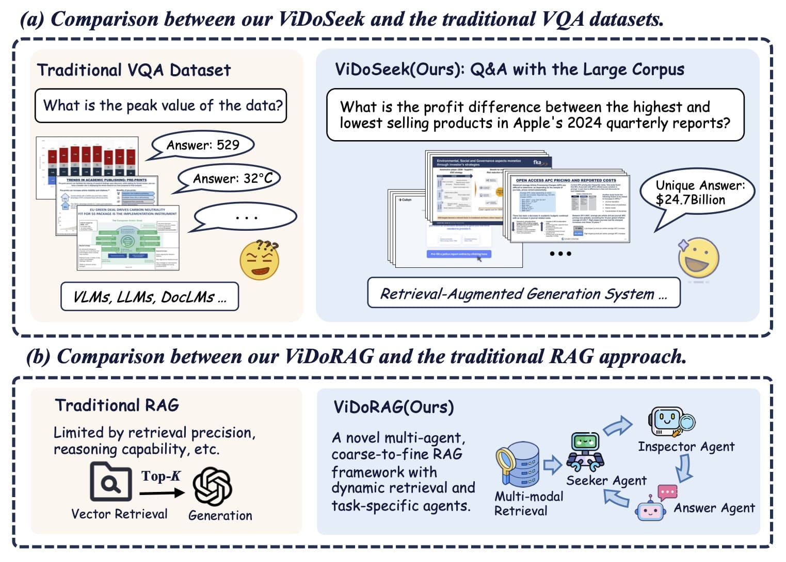

<!-- # <div align="center">ViDoRAG: Visual Document Retrieval-Augmented Generation via Dynamic Iterative Reasoning Agents<div> -->
<!-- # <div align="center">ViDoRAG<div>
<div align="center">
<strong>
<h3>Visual Document Retrieval-Augmented Generation via Dynamic Iterative Reasoning Agents</h3>
</strong>
</div> -->

# ViDoRAG: Visual Document Retrieval-Augmented Generation via Dynamic Iterative Reasoning Agents


<div align="center">
<a href='https://huggingface.co/datasets/autumncc/ViDoSeek'></a>
<a href='https://arxiv.org/abs/2502.18017'></a>
</div>

<!-- <p align="center">•
 <a href="#-Overview"> 🚀Overview </a> •
 <a href="#-visrag-pipeline">✨ VisRAG Pipeline</a> •
 <a href="#%EF%B8%8F-setup">⚙️ Setup</a> •
 <a href="#%EF%B8%8F-training">⚡️ Training</a> 
</p> -->

<div align="center">
<p align="center">
  
</p>
</div>

## 🔥 News
- 🎉 We have released the evaluation code, allowing you to customize your own evaluation pipeline.
- 🎉 Our framework integrates various embedding models, enabling you to create your own retriever.
- 🎉 We have released the ViDoSeek dataset, which is suitable for Retrieval-augmented Generation in the large visually rich document collection.

## 🚀Overview
- We introduce **ViDoSeek**, a benchmark specifically designed for visually rich document retrieval-reason-answer, fully suited for evaluation of RAG within large document corpus.
- We propose **ViDoRAG**, a novel RAG framework that utilizes a multi-agent, actor-critic paradigm for iterative reasoning, enhancing the noise robustness of generation models. 
- We introduce a GMM-based multi-modal hybrid retrieval strategy to effectively integrate visual and textual pipelines.
- Extensive experiments demonstrate the effectiveness of our method. ViDoRAG significantly outperforms strong baselines, achieving over 10% improvement, thus establishing a new state-of-the-art on ViDoSeek.

## 🔍ViDoSeek Dataset

We release our ViDoSeek dataset which designed for visually rich document retrieval-reason-answer. In ViDoSeek, each query has a unique answer and specific reference pages.

The provided JSON structure includes a unique identifier (uid) to distinguish queries, the query content (query), a reference answer (reference_answer), and metadata (meta_info) containing the original file name (file_name), reference page numbers (reference_page), data source type (source_type), and query type (query_type):
```json
{
    "uid": "04d8bb0db929110f204723c56e5386c1d8d21587_2",
    "query": "What is the temperature of Steam explosion of Pretreatment for Switchgrass and Sugarcane bagasse preparation?", 
    "reference_answer": "195-205 Centigrade", 
    "meta_info": {
        "file_name": "Pretreatment_of_Switchgrass.pdf", 
        "reference_page": [10, 11], 
        "source_type": "Text", 
        "query_type": "Multi-Hop" 
    }
}
```
You can use Git LFS to download annotation files and original documents from Hugging Face or ModelScope. The format of the files can refer to `./data/ExampleDataset`.

Then, you can use the following script to convert the original file into images:
```python
python ./scripts/pdf2images.py
```

Optionally, you can use OCR models or Vision-Language Models (VLMs) to recognize text within images:
```python
## triditional OCR models
python ./scripts/ocr_triditional.py 
## VLMs as ocr models (Optional)
python ./scripts/ocr_vlms.py 
```


## 💻 Running ViDoRAG
ViDoRAG is a novel multi-agent RAG framework tailored for complex reasoning across visual documents. ViDoRAG employs a Gaussian Mixture Model (GMM)-based hybrid strategy to effectively handle multi-modal retrieval.

<div align="center">
<p align="center">
  
</p>
</div>


### Dependencies
```bash
# Create environment
conda create -n vidorag python=3.10
# Clone project
git clone https://github.com/alibaba-nlp/ViDoRAG.git
cd ViDoRAG
# Install requirements
pip install -r requirements.txt
```
We recommend following the guidance of the [Colpali-engine](https://github.com/illuin-tech/colpali) and the [Transformer](https://github.com/huggingface/transformers) library to install the most suitable version.
<!-- > ⚠️ During our code review process, we discovered that the latest versions of Transformer, Llama Index, Copali Engine, and Qwen 2.5 are incompatible with each other. We recommend setting up separate environments for retriever and generation tasks. Detailed guidelines will be provided later. -->

Below is a step-by-step guide to help you run the entire framework on your own dataset. You can also use individual modules independently:  

### Step1. Build the Index Database
Our framework is built on the foundation of the Llama-Index. We preprocess the corpus in advance and then establish an index database. 

Before embedding the whole dataset, you can run `./llms/vl_embedding.py` to check whether the embedding model is loaded correctly:
```python
python ./llms/vl_embedding.py
```
Then, you can run `ingestion.py` to embedding the whole dataset:
```python
# Document ingestion and Multi-Modal Embedding
python ./ingestion.py
```
### Step2. Run Multi-Modal Retriever
Try using the basic single-modal search engine:
```python
from search_engine import SearchEngine
# initial engine
search_engine = SearchEngine(dataset='ViDoSeek', node_dir_prefix='colqwen_ingestion',embed_model_name='vidore/colqwen2-v1.0')
# Retrieve some results
recall_results = search_engine.search('some query')
```

Try using the dynamic single-modal search engine with GMM:
```python
from search_engine import SearchEngine
# initial engine
search_engine = SearchEngine(dataset='ViDoSeek', node_dir_prefix='colqwen_ingestion',embed_model_name='vidore/colqwen2-v1.0')
# Set parameters of dynamic retriever
search_engine.gmm = True
search_engine.input_gmm = 20 # The default setting is K
# Retrieve some results using dynamic recall
recall_results = search_engine.search('some query')
```

Try using the dynamic hybrid multi-modal search engine:
```python
from search_engine import HybridSearchEngine
# initial engine
hybrid_search_engine = HybridSearchEngine(dataset='ViDoSeek', embed_model_name_vl='vidore/colqwen2-v0.1', embed_model_name_text='BAAI/bge-m3', gmm=True)
# Retrieve some results using dynamic recall
hybrid_recall_results = hybrid_search_engine.search('some query')
```

Optionally, you can choose to test these features in `search_engine.py`.

### Step3. Run Multi-Agent Generation
You can directly use our script for generation in `vidorag_agents.py`, or you can integrate it into your own framework:
```python
from llms.llm import LLM
vlm = LLM('qwen-vl-max')
agent = ViDoRAG_Agents(vlm)
answer=agent.run_agent(query='Who is Tim?', images_path=['./data/ExampleDataset/img/00a76e3a9a36255616e2dc14a6eb5dde598b321f_1.jpg','./data/ExampleDataset/img/00a76e3a9a36255616e2dc14a6eb5dde598b321f_2.jpg'])
print(answer)
```

### Step4. Run Evaluation 
For our end-to-end evaluation, we employed a LLM-based assessment:
```bash
python eval.py \
  --experiment_type retrieval_infer ## choose from retrieval_infer/dynamic_hybird_retrieval_infer/vidorag
  --dataset ViDoSeek ## dataset folder name 
  --embed_model_name_vl ## vl embedding model name
  --embed_model_name_text ## text embedding model name
  --embed_model_name ## only for single embedding model eval, when you need not use vl or text above
  --generate_vlm ## VLMs name eg. gpt-4o/qwen-max-vl

```


## 📝 Citation

```bigquery
@article{wang2025vidorag,
  title={ViDoRAG: Visual Document Retrieval-Augmented Generation via Dynamic Iterative Reasoning Agents},
  author={Wang, Qiuchen and Ding, Ruixue and Chen, Zehui and Wu, Weiqi and Wang, Shihang and Xie, Pengjun and Zhao, Feng},
  journal={arXiv preprint arXiv:2502.18017},
  year={2025}
}
```